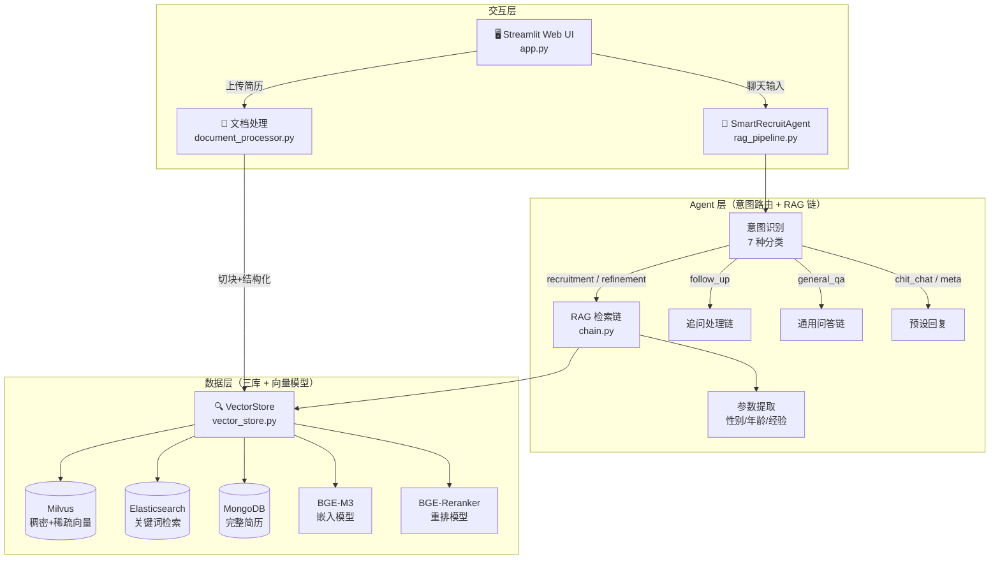
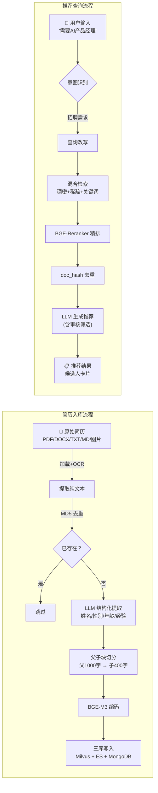

# SmartRecruit — 基于 RAG 的智能简历推荐系统

> 用户输入自然语言招聘需求，系统通过多路召回 + 重排 + LLM 审核从简历库中自动匹配候选人。

## 项目简介

SmartRecruit 展示了如何用 **RAG（检索增强生成）** 技术构建一个实用的简历推荐系统。系统并非简单的关键词匹配，而是模拟真实招聘场景：

- 用户像和 HR 聊天一样描述需求（"我需要一个5年经验的 Python 后端，最好有分布式系统经验"）
- 系统自动理解意图、提取筛选条件（性别/年龄/经验年限），从简历库中检索
- 最终由 LLM 做最后一道审核，只推荐真正匹配的候选人

## 核心技术亮点

| 能力 | 实现方式 |
|---|---|
| **多路召回** | Milvus 稠密向量 + 稀疏向量（BGE-M3 一路出两路）+ ES BM25 关键词，三路合并 |
| **智能重排** | BGE-Reranker CrossEncoder 精排，按语义相关性重排所有召回结果 |
| **结构化过滤** | LLM 提取性别、年龄、经验等参数，转为 Milvus Filter 表达式缩小搜索范围 |
| **父子块策略** | 父块（1000字）保完整语义，子块（400字）提高检索精度，重排时用父块文本 |
| **意图路由** | 7 种意图分类（招聘/修改条件/追问/通用问答/闲聊/元问题/兜底），不同意图走不同处理链 |
| **多轮对话** | 对话历史感知，支持逐步细化需求（"男的" "再加个3年以上经验"） |
| **LLM 生成推荐** | LLM 根据用人需求和重排后的简历上下文，生成结构化推荐（Prompt 中内置审核筛选逻辑） |
| **去重机制** | 基于 doc_hash 去重，同份简历不会重复推荐 |

## 系统架构

```
用户输入 → 意图识别 → 参数提取 → 查询改写 → 三路召回(Milvus+ES) → 合并去重 → 重排 → LLM生成推荐(含审核筛选) → 推荐结果
```

**数据存储**采用三库架构：
- **Milvus**：存储稠密+稀疏向量，负责语义检索
- **Elasticsearch**：BM25 关键词检索，弥补向量检索在精确匹配上的不足
- **MongoDB**：存储完整简历原文和结构化元数据（姓名、性别、年龄、经验等）

## 整体架构



## 模块说明

| 模块 | 文件 | 职责 |
|---|---|---|
| 文档处理 | `utils/document_processor.py` | 多格式加载、结构化提取、父子块切分 |
| 向量存储 | `utils/vector_store.py` | Milvus/ES/MongoDB 三库管理、混合检索+重排 |
| RAG 链 | `rag/chain.py` | LangChain LCEL 链：查询改写→检索→生成 |
| 意图路由 | `rag/rag_pipeline.py` | Agent 意图识别、参数提取、多轮对话管理 |
| 评估 | `eval/evaluator.py` | Ragas 四指标评估（忠实度/相关性/精确度/召回度） |
| Web 应用 | `app.py` | Streamlit UI：聊天推荐 + 简历上传 |
| 数据初始化 | `system_data_init.py` | 批量扫描简历目录并入库 |
| 配置 | `config.py` | Pydantic 配置：数据库连接、模型路径、切分参数 |

## 技术栈

| 角色 | 技术 | 说明 |
|---|---|---|
| 向量数据库 | Milvus 2.5 | 存储稠密+稀疏向量，支持混合检索 |
| 全文检索 | Elasticsearch 8.x | BM25 关键词检索 |
| 文档存储 | MongoDB 7.x | 完整简历原文 + 元数据 |
| 嵌入模型 | BGE-M3（本地） | 1024 维稠密 + 稀疏向量，一个模型两路召回 |
| 重排模型 | BGE-Reranker-Base（本地） | CrossEncoder 精排 |
| LLM | 通义千问 qwen-plus | 意图识别、参数提取、查询改写、答案生成 |
| 框架 | LangChain 0.3 | LCEL 链式编排 |
| 前端 | Streamlit 1.45 | Web UI 原型 |
| 评估 | Ragas 0.2 | RAG 质量评估 |

## 数据流



## 目录结构

```
2026-04-22-smartrecruit/
├── app.py                      # Streamlit 主应用（交互层）
├── config.py                   # Pydantic 配置类
├── system_data_init.py         # 批量简历入库脚本
├── .env                        # 环境变量（DASHSCOPE_API_KEY）
├── requirements.txt            # Python 依赖
│
├── rag/                        # Agent 层
│   ├── chain.py                # RAG 检索链（LCEL）
│   └── rag_pipeline.py         # 意图路由 Agent
│
├── utils/                      # 数据层
│   ├── document_processor.py   # 文档加载与处理
│   ├── vector_store.py         # 向量存储与检索
│   └── model_download.py       # 模型下载工具（BGE-M3/BGE-Reranker）
│
├── eval/                       # 评估模块
│   └── evaluator.py            # Ragas 评估
│
├── models/                     # 本地模型文件
│   ├── bge-m3/                 # BGE-M3 嵌入模型
│   └── bge-reranker-base/      # BGE-Reranker 重排模型
│
├── mongodb/                    # MongoDB 前置学习（基础操作演示）
├── elasticsearch/              # Elasticsearch 前置学习（基础操作演示）
├── milvus/                     # Milvus 前置学习（基础操作演示）
├── data/resume/                # 简历文件（支持 PDF/DOCX/TXT/MD/图片）
├── tests/                      # 测试脚本
├── logs/                       # 运行日志
│
├── deployment/                 # Docker 部署文件
    └── docker-compose.yml    # 中间件编排（MongoDB/ES/Milvus/Attu）
```

### 环境依赖

- Docker + Docker Compose（用于部署 MongoDB、Elasticsearch、Milvus）
- Python 3.10+
- 通义千问 API Key（[DashScope](https://dashscope.aliyuncs.com/)）

### 部署步骤

```bash
# 1. 配置 Docker 镜像加速（见 lectures/00-deployment/ 第三节）
# 2. 启动中间件
cd deployment
docker compose up -d

# 3. 创建 Python 环境
#  venv:
python3 -m venv .venv && source .venv/bin/activate

# 4. 安装依赖
pip install -r requirements.txt

# 5. 配置 API Key
echo 'DASHSCOPE_API_KEY=sk-your-actual-api-key' > .env

# 6. 初始化简历数据
python system_data_init.py

# 7. 启动应用
streamlit run app.py
```
